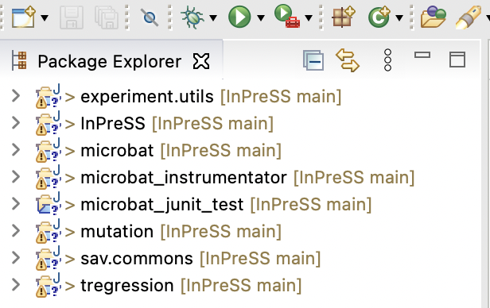

# InPreSS

This repository hosts InPress, a regression analysis approach based on program slicing. 
Given a test failure and two versions of a program and a test passing on one and failing on the other version of the program, 
InPreSS automatically generates a summarized version of the slices produced by the dual slicing technique. 

## Citation

If you need to reference our technique, please use the following citations:

Sahar Badihi*, Khaled Ahmed, Yi Li, Julia Rubin. "Responsibility in Context: On Applicability of Slicing in Semantic Regression Analysis." The 45th IEEE/ACM International Conference on Software Engineering (ICSE), 2023. (*corrsponding author)

---
---

## Table of Contents
1. [Requirements](#Requirements)
2. [Building the Tool](#Building-the-Tool)
3. [Running the Tool](#Running-the-Tool)

---
---

## Requirements

* Running platform: Linux or MacOS

* Java Runtime Environment version: 8

* Eclipse version: 4.16

---
---

## Building the Tool

InPreSS relies on the TRegression (ERASE) (https://github.com/llmhyy/tregression) project to align the two traces. 
It also relies on Slicer4J (https://github.com/resess/Slicer4J) to compute control and data-flow dependencies. 
As these projects are developing separately, to prevent any inconsistencies between the tool versions that we used and newer versions, 
we included the repositories of Slicer4J, ERASE, and its underlying Microbat (https://github.com/llmhyy/microbat) project.

1. Start with cloning the repository:
````yaml
git clone https://github.com/resess/InPreSS.git
````
In this repo, we provide:
- microbat: including all microbat subprojects
- tregression
- Slicer4J
- InPreSS

Note that InPreSS, Microbat, and TRegression projects are Eclipse plugin project. 

2. You need to import the following projects through "Existing Projects into Workspace":



- InPreSS
- mirobat/experiment.utils
- microbat/mirobat
- mirobat/microbat_instrumentator
- mirobat/microbat_junit_test
- mirobat/mutation
- mirobat/sav.commons
- tregression/tregression

---
---

### Running the Tool Through the Docker Image
A docker image with required dependencies is available for easy use and evaluation of the artifacts. The docker image includes the implemented InPreSS tool.

To download and open the container, run the following two commands (**Note:** downloading the docker image may take more or less time depending on the Internet speed)
```
docker pull saharbadihi/inpress:latest
docker run -it saharbadihi/inpress:latest
```

InPreSS code is available under `/review` main directory.
This directory is the default work directory of the docker container. However, you can navigate to it as follows:

```
cd /review
```

---
---

## Running the Tool Through the Plugin 
### General guideline: Running with Main() method in Run
Now, you can run InPreSS through the main method in the run class (run as "Java Application"):


The main method takes as input following four arguments: 
- the path to the base folder, including two versions (See below for our subjects and Defects4J). 
- The benchmark name to run: InPreSS, Math, Closure, ....
- The bug_id
- The failing test

Here is an example of the structure of the bug repositories:


---

### Running on Our Subjects
As running the client and library projects needs merging two projects in one and creating a merged jar to run Slicer4J, we provide the merged and ready to run folders in a Google Drive folder (https://drive.google.com/file/d/1XZ_lJG7cgMJvOSvlURCJgSG3Hu-cFvWM/view?usp=share_link).

The structure of the folder is as follows:

|__ InPreSS<br />
&nbsp;&nbsp;&nbsp;&nbsp;&nbsp;&nbsp;|__ 1 <br />
&nbsp;&nbsp;&nbsp;&nbsp;&nbsp;&nbsp;|__ 2 <br /> 
&nbsp;&nbsp;&nbsp;&nbsp;&nbsp;&nbsp;|__ ...<br />

Here is an example of running bug_id 6 of InPreSS subjects:


Where, the base folder storing the InPreSS subjects is "Users/sahar1/Documents/Projects/bug_repos/". 
"InPreSS" is the name of the benchmark to run. 
Bug_id is 6 and the failing test is "com.intuit.wasabi.export.rest.impl.DefaultRestEndPointTest::testGetRestEndPointURI".

The failing test (test_class::test_method) is stored in the "failing_tests" file in the buggy version of each subject. 

---

### Running on Defects4J
Follow the instructions in https://github.com/llmhyy/tregression to create the Defects4J Benchmarks: 
The structure of Defects4J is as follows:

|__ Math<br />
&nbsp;&nbsp;&nbsp;&nbsp;&nbsp;&nbsp;|__ 1 (bug_id)<br />
&nbsp;&nbsp;&nbsp;&nbsp;&nbsp;&nbsp;|__ 2 (bug_id)<br />
&nbsp;&nbsp;&nbsp;&nbsp;&nbsp;&nbsp;|__ ...<br />
|__ Closure<br />
&nbsp;&nbsp;&nbsp;&nbsp;&nbsp;&nbsp;|__ 1 (bug_id)<br />
&nbsp;&nbsp;&nbsp;&nbsp;&nbsp;&nbsp;|__ 2 (bug_id)<br />
&nbsp;&nbsp;&nbsp;&nbsp;&nbsp;&nbsp;|__ ...<br />

You can run each bugs similar to running our subjects. 

---
---

## Running the Tool Through the Jar 

Run the code through the jar (including dependencies): 

```
cd InPreSS
InPreSS/InPreSS$ java -Xss5m -XX:-UseGCOverheadLimit -Xms8g -jar InPreSS.jar "/.../path-to-benchmark-folder" "InPreSS" "6" "com.intuit.wasabi.export.rest.impl.DefaultRestEndPointTest::testGetRestEndPointURI"
```